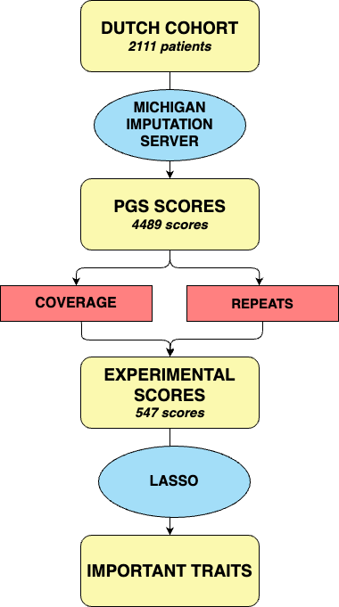

# Using polygenic scores as a predictive model for bipolar disorder to assess pleiotropic effects

Alex Everett's project for the UCLA Bruins-in-Genomics summer program in 2024. Analyzing PGS scores from bipolar patient data.

## Authors

- Alex Everett
- Naren Ramesh
- Lingyu Zhan
- Roel Ophoff

Center for Neurobehavioral Genetics, Semel Institute for Neuroscience and Human Behavior and Department of Human Genetics, David Geffen School of Medicine, University of California Los Angeles, Los Angeles, CA, USA

# Abstract

Bipolar disorder is a complex, heritable neuropsychiatric condition characterized by recurring episodes of mania and depression, influenced by complex genetic factors. This study investigates the potential of polygenic scores (PGS) to reveal the genetic relationships between bipolar disorder and various other traits. Using summary statistics from 547 traits, we computed PGS based on genotype data from a cohort of 2111 Dutch patients, including 950 with bipolar disorder. By applying a LASSO regression to build a predictive model for case/control diagnosis, our research aims to assess the pleiotropic effects of genetic variants linked with disease risks and identify specific traits that most significantly contribute to or are affected by bipolar disorder.

## Experimental Objective

To assess the effects of genetic variants linked with disease risks and identify traits that contribute to or are influenced by bipolar disorder.

# Contents

- [Context](#context)
- [Methods](#methods)
  - [Scripts](#scripts)
  - [Pipeline](#scripts)

## Context

* Polygenic scores (PGS) represent the cumulative effects of genetic variants on the development of a specific trait.
  * Polygenicity refers to the influence of multiple genes on a single trait.
  * Pleiotropy describes the phenomenon where a single condition affects multiple traits.
* Genome-wide association studies (GWAS) identify genetic variants associated with traits by analyzing the genomes of large groups of individuals.
  * GWAS data is the initial source for PGS calculations.
* The Michigan Imputation Server is a web-based tool that processes GWAS data, generating over 4,500 PGS for over 650 traits based on studies registered in the online PGSCatalog.
* A LASSO logistic regression model is employed to predict case/control status using PGS. This model identifies key variables based on their contribution to prediction accuracy.

## Methods

We began with a cohort of Dutch patients, consisting of 950 cases and 1,161 controls. The collected GWAS data were processed using the Michigan Imputation Server to calculate PGS for all individuals. Initially, the server generated 4,489 scores. We filtered these scores by removing those with low coverage (75% - 0%) and duplicates, retaining only scores predominantly from European ancestry and more recent publications. This filtering reduced the dataset to 547 traits for the 2,111 patients.

The patient scores were then split into training and validation sets (70/30) 100 times and analyzed using a LASSO regression model. The model identified 456 traits as significant based on their contribution to predicting case/control status, with each trait's importance reflected in its associated coefficient.

### Scripts

* lasso.py
  * Splits data into training & validation sets before performing a LASSO regression
  * Repeats process 100 times
* catenate.py
  * Takes important variable files from LASSO results and concatenates them into one file
  * test_catenate.py
    * Same thing, but with model performance
* coeff_traits.R
  * Adds "Mapped Traits" column based on PGSCatalog
* bar_plot.R
  * Plots the top and bottom 25 traits ranked by descending average coefficients
* test_lasso.py
  * Runs two LASSO models with the same training / validation set and tests them with bipolar scores & without

### Pipeline

